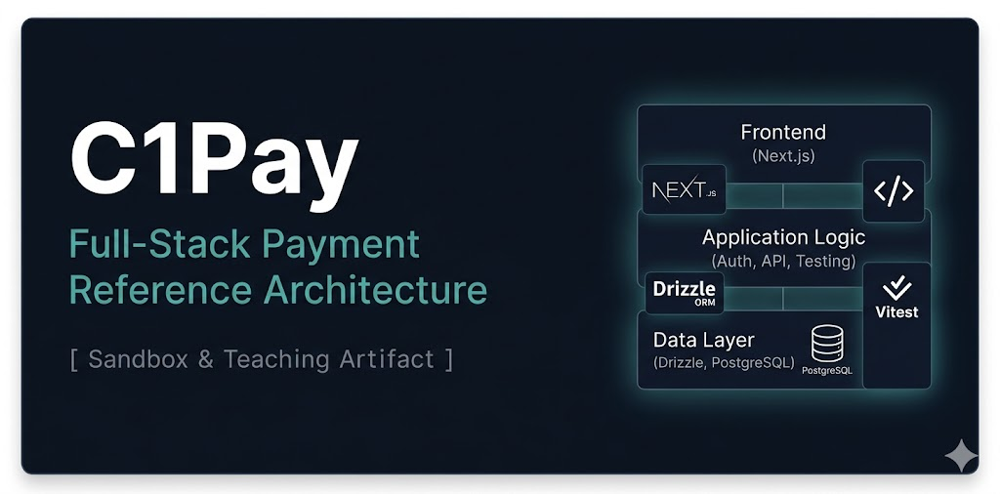

  

A Venmo/Zelle-style sandbox web app built as a team knowledge-sharing reference codebase. The goal is to demonstrate full-stack software development best practices for a mid-level to senior developer audience — not production software, but a deliberate teaching artifact where every decision is worth examining.

## What it demonstrates

- JWT authentication with secure token handling
- User registration and account management
- Payment requests between registered users (no real money movement)
- Mobile-responsive UI
- Full-stack best practices across architecture, testing, and data access

## Stack

| Layer | Technology |
|---|---|
| Frontend | Next.js |
| ORM | Drizzle ORM |
| Database | PostgreSQL |
| Auth | JWT |
| Testing | Vitest |

## Purpose

This repo is a reference codebase — read it, study it, and use it as a baseline for team discussions on tradeoffs and patterns. The structure and decisions are intentional and designed to be visible to the reader.
